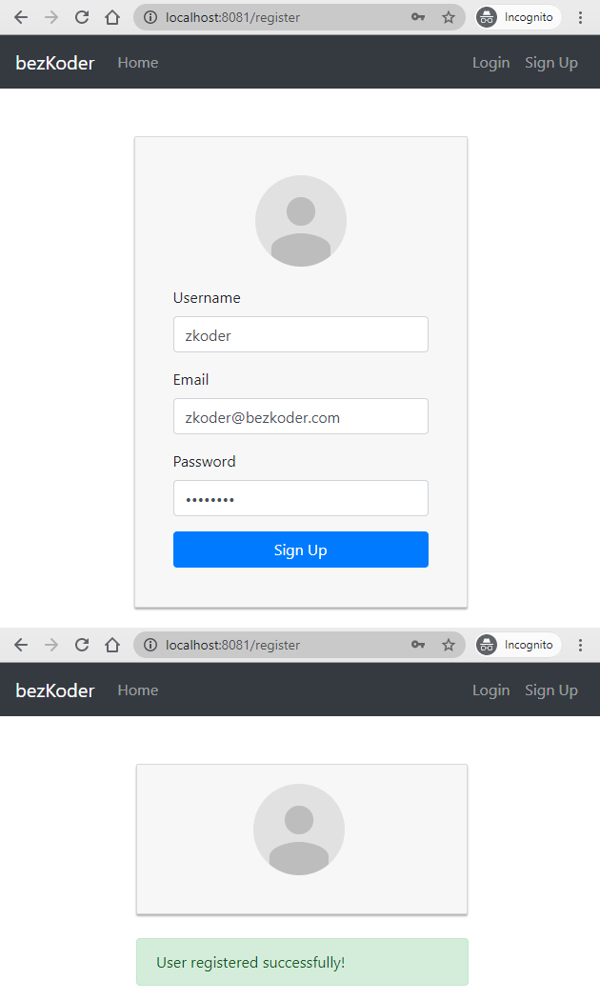
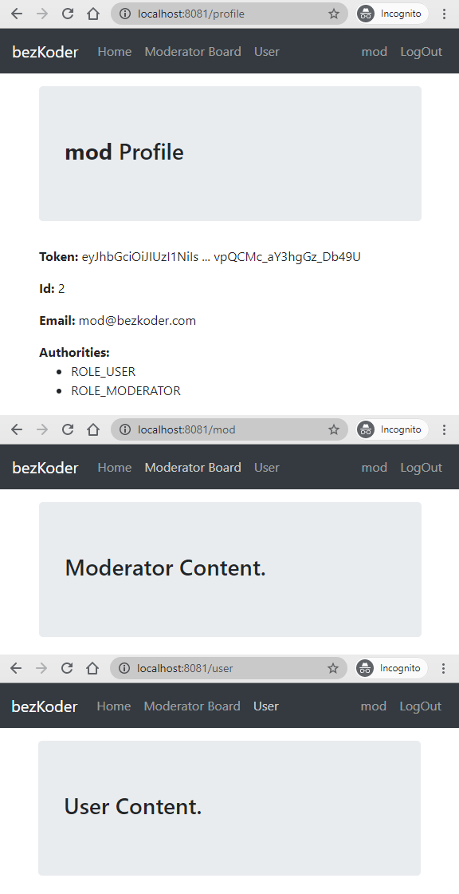

## Redux-toolkit Authentication & Authorization example

- JWT Authentication & Authorization Flow for User Login, Register, Logout
- Project Structure for React Redux JWT Authentication, Router, Axios
- Working with Redux Actions, Reducers, Store using redux-toolkit
- Storing JWT in HttpOnly Cookies
- Creating React Function Components with Hooks & Form Validation
- React Function Components for accessing protected Resources (Authorization)
- Dynamic Navigation Bar in React App

Signup Page:



Login Page:


For Authorized account login (Moderator for example), the navigation bar will change:



This project was bootstrapped with [Create React App](https://github.com/facebook/create-react-app).

### Project setup

In the project directory, you can run:

```
npm install
# or
yarn install
```

or

### Compiles and hot-reloads for development

```
npm start
# or
yarn start
```

Open [http://localhost:8081](http://localhost:8081) to view it in the browser.

The page will reload if you make edits.
